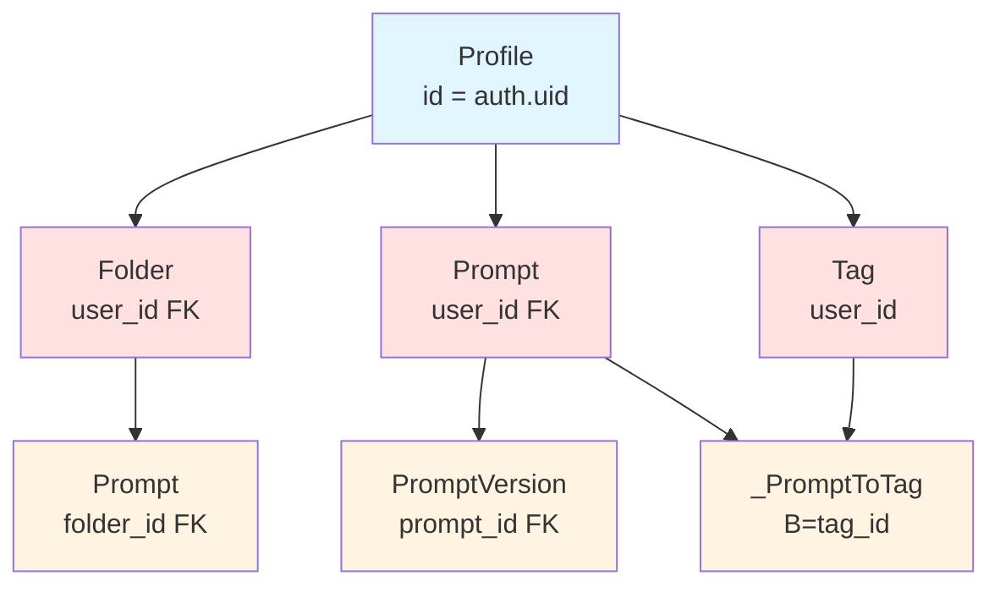

# PromptHub
## P3S1: Row Level Security (RLS) Policies - INITIAL REPORT

| `Title` | `Created` | `Last modified` |
|---------|-----------|-----------------|
| P3S1: Row Level Security (RLS) Policies - INITIAL REPORT | 06/11/2025 20:09 GMT+10 | 06/11/2025 20:09 GMT+10 |

## Table of Contents
- [Executive Summary](#executive-summary)
- [Scope and Objectives](#scope-and-objectives)
- [Prerequisites and Dependencies](#prerequisites-and-dependencies)
- [Technical Approach](#technical-approach)
- [Implementation Plan](#implementation-plan)
- [Risk Assessment](#risk-assessment)
- [Success Metrics](#success-metrics)
- [Timeline and Effort Estimate](#timeline-and-effort-estimate)

---

## Executive Summary

This report outlines the planned implementation of Row Level Security (RLS) policies for the PromptHub application. RLS is a critical security layer that enforces data isolation at the PostgreSQL database level, ensuring users can only access their own data regardless of application-level vulnerabilities.

### Key Deliverables
1. RLS policies for 6 database tables (Profile, Folder, Prompt, Tag, PromptVersion, _PromptToTag)
2. Schema fix for Tag table to support per-user tag namespaces
3. Comprehensive multi-user validation testing
4. Performance validation to ensure no degradation

### Current Status
- **Plan Status**: READY
- **Prerequisites**: Phase 2 (Authentication) is complete
- **Estimated Duration**: 3-4 hours (single FTE)
- **Risk Level**: Low-Medium (well-documented patterns, requires thorough testing)

---

## Scope and Objectives

### In Scope
- Enable RLS on all user-specific tables
- Create SELECT, INSERT, UPDATE, DELETE policies as appropriate for each table
- Fix Tag schema to support per-user unique tag names
- Implement Supabase performance best practices (wrapped auth.uid(), explicit roles)
- Multi-user validation testing to confirm data isolation
- Performance testing to verify index usage

### Out of Scope
- Application code changes (RLS is database-level)
- Admin/service account policies (use service role key for admin operations)
- RLS for system tables or non-user-specific data
- Automated testing framework (manual validation sufficient for this phase)

### Objectives
1. **Security**: Ensure complete data isolation between users
2. **Performance**: Maintain query performance with proper index usage
3. **Compliance**: Follow Supabase and PostgreSQL best practices
4. **Maintainability**: Create clear, well-documented policies

---

## Prerequisites and Dependencies

### Completed Prerequisites
- ✅ **P2S1**: Supabase Auth Trigger for Profile Creation
- ✅ **P2S3**: Authentication Server Actions (Sign Up, Sign In, Sign Out)
- ✅ **P2S4**: Protected Route Middleware
- ✅ Database schema with proper indexes on user_id columns
- ✅ Supabase project configured and accessible

### Required Access
- Supabase dashboard access: https://supabase.com/dashboard/project/xmuysganwxygcsxwteil
- Supabase SQL Editor access (cannot use Prisma migrations for RLS)
- Ability to create test user accounts in Supabase Auth

### Dependencies
- **Blocks**: None (can proceed immediately)
- **Blocked By**: None - this is a critical prerequisite for Phase 4 work
- **Concurrent Work**: Can proceed in parallel with Phase 1-2 refinements

---

## Technical Approach

### Database Tables Requiring RLS



### Policy Strategy

**Direct Ownership Tables** (have user_id column):
- Profile, Folder, Prompt, Tag
- Policy: `(SELECT auth.uid()) = user_id`
- Operations: Full CRUD access to own data

**Indirect Ownership Tables** (ownership via FK):
- PromptVersion (via Prompt)
- _PromptToTag (via both Prompt and Tag)
- Policy: EXISTS subquery checking parent table ownership
- Operations: Limited to SELECT, INSERT, DELETE

### Performance Optimization Patterns

1. **Wrapped auth.uid()**: `(SELECT auth.uid())` instead of `auth.uid()`
   - Caches result per-statement instead of calling per-row
   - Critical for query performance

2. **Explicit Role**: `TO authenticated` instead of no role specification
   - Prevents policy evaluation for anonymous users
   - Stops execution early for better performance

3. **NULL Check**: `(SELECT auth.uid()) IS NOT NULL`
   - Explicit authentication requirement
   - Prevents silent failures for anonymous users

4. **Index Usage**: Existing indexes on user_id columns
   - `Folder_user_id_parent_id_idx`
   - `Prompt_user_id_folder_id_idx`
   - `Tag_user_id_idx`
   - Ensures policies don't cause table scans

---

## Implementation Plan

### Phase 1: Schema Fixes (15 minutes)

**Task 1: Fix Tag Unique Constraint**
- Current Issue: `Tag.name` has global UNIQUE constraint
- Problem: Two users cannot have same tag name
- Solution: Change to composite UNIQUE (name, user_id)
- File: `wip/P3S1-tag-schema-fix.sql`
- Execution: Supabase SQL Editor

```sql
-- Drop global unique constraint
ALTER TABLE "Tag" DROP CONSTRAINT "Tag_name_key";

-- Add per-user unique constraint
ALTER TABLE "Tag" ADD CONSTRAINT "Tag_name_user_id_key"
  UNIQUE ("name", "user_id");
```

### Phase 2: Enable RLS (10 minutes)

**Task 2: Enable RLS on All Tables**
- Enable row-level security on 6 tables
- After enabling, no data accessible until policies created
- Verification: Check `pg_tables.rowsecurity = true`

### Phase 3: Create Policies (60 minutes)

**Task 3-8: Create RLS Policies**
- Profile: SELECT, UPDATE (2 policies)
- Folder: SELECT, INSERT, UPDATE, DELETE (4 policies)
- Prompt: SELECT, INSERT, UPDATE, DELETE (4 policies)
- Tag: SELECT, INSERT, DELETE (3 policies)
- PromptVersion: SELECT, INSERT (2 policies)
- _PromptToTag: SELECT, INSERT, DELETE (3 policies)

**Total: 18 policies across 6 tables**

File: `wip/P3S1-rls-policies.sql`

### Phase 4: Validation Testing (60 minutes)

**Task 9: Multi-User Validation**
- Create test user: test@example.com
- Execute 7 test scenarios:
  1. Profile isolation
  2. Folder isolation
  3. Prompt isolation
  4. Tag isolation (verify per-user namespaces)
  5. PromptVersion isolation
  6. Tag association isolation
  7. Unauthenticated access (should return empty)

Documentation: `wip/P3S1-rls-validation-test.md`

**Task 10: Performance Validation**
- Run EXPLAIN ANALYZE on queries
- Verify index usage
- Verify auth.uid() caching (InitPlan)
- Confirm execution times < 10ms for small datasets

Documentation: `wip/P3S1-rls-performance-test.md`

---

## Risk Assessment

### High Priority Risks

| Risk | Impact | Likelihood | Mitigation |
|------|--------|------------|------------|
| Syntax errors in SQL | High | Low | Test each policy individually, review Supabase docs |
| Policy blocks legitimate access | High | Medium | Thorough multi-user testing with documented scenarios |
| Performance degradation | Medium | Low | Follow optimization patterns, verify with EXPLAIN ANALYZE |
| Tag constraint fix breaks existing data | Medium | Low | Verify no duplicate (name, user_id) pairs before migration |

### Medium Priority Risks

| Risk | Impact | Likelihood | Mitigation |
|------|--------|------------|------------|
| Testing requires manual user creation | Low | High | Document clear testing procedures, use test accounts |
| Policies cannot be version controlled in Prisma | Low | Medium | Store in wip/ directory, document in project |
| Forgot to enable RLS on a table | High | Low | Verification query included in validation steps |

### Technical Challenges

1. **Manual SQL Execution**: Cannot use Prisma migrations for RLS policies
   - Must use Supabase SQL Editor
   - Requires copy-paste from wip/ files
   - Mitigation: Clear step-by-step instructions in PRP

2. **Multi-User Testing Complexity**: Requires multiple browser sessions/incognito
   - Time-consuming to switch between users
   - Mitigation: Comprehensive test plan with expected results documented

3. **Policy Debugging**: RLS failures return empty results, not error messages
   - Can be confusing to debug
   - Mitigation: Enable PostgreSQL logging if issues arise

---

## Success Metrics

### Functional Requirements
- ✅ RLS enabled on all 6 tables
- ✅ All 18 policies created successfully
- ✅ Tag schema supports per-user unique names
- ✅ User A cannot access User B's data (verified for all tables)
- ✅ User A can perform all CRUD operations on own data
- ✅ Unauthenticated requests return empty results (not errors)

### Performance Requirements
- ✅ Query execution time < 10ms for small datasets
- ✅ Indexes used for all user_id filters (verified with EXPLAIN ANALYZE)
- ✅ auth.uid() cached per-statement (InitPlan in query plan)
- ✅ No table scans on user-specific tables

### Quality Requirements
- ✅ All policies follow Supabase best practices
- ✅ All SQL documented in wip/ directory
- ✅ Validation testing documented with results
- ✅ Performance testing documented with query plans

---

## Timeline and Effort Estimate

### Task Breakdown

| Task | Description | Estimated Time |
|------|-------------|----------------|
| T1 | Fix Tag unique constraint | 15 minutes |
| T2 | Enable RLS on all tables | 10 minutes |
| T3 | Create Profile policies | 10 minutes |
| T4 | Create Folder policies | 15 minutes |
| T5 | Create Prompt policies | 15 minutes |
| T6 | Create Tag policies | 10 minutes |
| T7 | Create PromptVersion policies | 10 minutes |
| T8 | Create _PromptToTag policies | 15 minutes |
| T9 | Multi-user validation testing | 45 minutes |
| T10 | Performance validation testing | 30 minutes |
| - | Documentation and cleanup | 15 minutes |

**Total Estimated Time: 3-4 hours (single FTE)**

### Critical Path
1. Fix Tag schema (blocks policy creation)
2. Enable RLS (blocks policy creation)
3. Create policies (blocks testing)
4. Validation testing (required for completion)

**Minimum Viable Completion: 2.5 hours** (if testing goes smoothly)
**Conservative Estimate: 4 hours** (if issues require debugging)

---

## Recommendations

### Agent Assignments

**Primary Agent**: `security-specialist`
- Tasks 1-8: Schema fixes and policy creation
- Expertise in database security and PostgreSQL

**Secondary Agent**: `qa-test-automation-engineer`
- Tasks 9-10: Validation and performance testing
- Can work in parallel once policies are deployed

### Implementation Notes

1. **Sequential Execution Required**:
   - Must fix Tag schema before creating policies
   - Must enable RLS before creating policies
   - Must create policies before testing

2. **Testing Strategy**:
   - Create test user at start of testing phase
   - Use two browser sessions (normal + incognito) for concurrent testing
   - Document all test results in markdown files

3. **Rollback Plan**:
   - If issues arise: `DROP POLICY policy_name ON table_name;`
   - RLS can be disabled: `ALTER TABLE table_name DISABLE ROW LEVEL SECURITY;`
   - Tag constraint can be reverted with inverse migration

4. **Supabase SQL Editor Usage**:
   - Copy SQL from wip/ files
   - Execute in sections (schema fix, enable RLS, policies)
   - Verify each section before proceeding

---

## Appendix: Policy Count by Table

| Table | SELECT | INSERT | UPDATE | DELETE | Total |
|-------|--------|--------|--------|--------|-------|
| Profile | 1 | - | 1 | - | 2 |
| Folder | 1 | 1 | 1 | 1 | 4 |
| Prompt | 1 | 1 | 1 | 1 | 4 |
| Tag | 1 | 1 | - | 1 | 3 |
| PromptVersion | 1 | 1 | - | - | 2 |
| _PromptToTag | 1 | 1 | - | 1 | 3 |
| **TOTAL** | **6** | **5** | **3** | **4** | **18** |

---

**Plan Status**: READY
**PRP Status**: TODO
**PRP ID**: P3S1
**Archon Project**: PromptHub (d449f266-1f36-47ad-bd2d-30f1a0f5e999)
**PRP Document**: PRPs/P3S1-row-level-security-policies.md
**Tasks**: 10 tasks (P3S1T1 - P3S1T10)
**Phase**: Phase 3 - Data Security and Core Data Access
**Dependencies**: P2S1 (Complete), P2S3 (Complete), P2S4 (Complete)
**Implementation Status**: NOT YET STARTED (P3S1)
**Testing Status**: NOT YET TESTED
**Next PRP**: P4S1 - Folder Data Access Server Actions
**Recommendations:**
Agents:
- `security-specialist` (Tasks 1-8: Schema fixes and policy creation)
- `qa-test-automation-engineer` (Tasks 9-10: Validation and performance testing)
Notes:
- Tasks 1-8 must be sequential (schema fix → enable RLS → create policies)
- Tasks 9-10 can run in parallel after T8 completes
- Use Supabase SQL Editor for all SQL execution (cannot use Prisma migrations)
- Create test user account at start of validation phase
**Estimated Implementation Time (FTE)**: 3-4 hours
