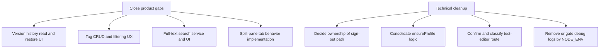

# PromptHub
## Integration Gaps and Legacy Candidate Audit

| `Title` | `Created` | `Last modified` |
|---------|-----------|-----------------|
| Integration Gaps and Legacy Candidate Audit | 08/03/2026 12:20 GMT+10 | 08/03/2026 12:20 GMT+10 |

## Table of Contents
- [Audit criteria](#audit-criteria)
- [Definitive non-integrated features](#definitive-non-integrated-features)
- [Ghost and legacy code candidates](#ghost-and-legacy-code-candidates)
- [Debug and development-only code observations](#debug-and-development-only-code-observations)
- [Do-not-remove safeguards](#do-not-remove-safeguards)
- [Recommended integration backlog](#recommended-integration-backlog)

## Audit criteria
A candidate is marked as ghost or legacy only when verified by cross-reference search and runtime usage patterns:
- no imports or usage paths for module candidates,
- placeholder implementations with explicit TODO/deferred markers,
- planned systems present in schema/types but absent from action and UI layers,
- diagnostic/test routes not connected to product flow.

## Definitive non-integrated features
### Version history UI and retrieval
- Confirmed state: not implemented as a functional feature.
- Evidence:
  - `HistoryButton` only displays a toast message and does not open any history panel or data source.
  - `applyPatch` exists in diff utilities but is explicitly marked for future use and is not connected to version browsing UX.
- Impact: users can save versions but cannot inspect or restore prior versions in-product.

### Tagging system
- Confirmed state: schema-level only.
- Evidence:
  - Prisma schema defines `Tag` and `Prompt` many-to-many relation.
  - No tag actions, no tag UI components, and no tag filters in prompt list rendering logic.
- Impact: core organization feature remains unavailable despite database readiness.

### Full-text search using `content_tsv`
- Confirmed state: index/schema only.
- Evidence:
  - `Prompt.content_tsv` and GIN index exist in Prisma model.
  - No server action invokes full-text SQL or Prisma raw query for search.
- Impact: search feature described in planning docs is not active in runtime.

### Split pane tabs
- Confirmed state: scaffolding only.
- Evidence:
  - Store interface includes `splitPane` and `closePane`.
  - Concrete implementations are TODO placeholders that log warnings and do not mutate layout tree.
- Impact: advanced tab layout is designed but unavailable.

## Ghost and legacy code candidates
### Unreferenced module: `src/components/Header.tsx`
- Verified by import graph search: no module imports this component.
- Current app layout uses `src/components/layout/Header.tsx` instead.
- Risk profile: low-to-medium; likely superseded component retained from earlier architecture.
- Action: keep for now, mark as superseded candidate pending team confirmation.

### Unreferenced barrel files
- `src/features/editor/hooks/index.ts`
- `src/features/tabs/hooks/index.ts`
These barrel files are not imported by current runtime paths. They are non-breaking but add maintenance noise.

### Hybrid router test page
- `src/pages/test-editor.tsx` is a Pages Router diagnostic path retained alongside App Router implementation.
- It is referenced by PRP docs for manual testing, not by in-app navigation.
- Candidate classification: intentional diagnostic artifact; keep if still needed for Monaco regressions.

### Redundant sign-out paths
- Sign-out exists both as server action (`features/auth/actions.ts`) and route handler (`app/auth/sign-out/route.ts`).
- Current header path uses server action, not route handler form post URL.
- Candidate classification: possible fallback pathway or historical compatibility path; confirm desired ownership before removal.

### Duplicated profile bootstrap logic
- Profile creation guard exists in shared util (`lib/ensure-profile.ts`) and duplicated local functions in auth actions.
- Candidate classification: refactor candidate (consolidation) rather than dead code.

## Debug and development-only code observations
- `src/app/api/debug/route.ts` exposes diagnostic state and connection checks. This is useful during development and deployment diagnostics, but should have explicit production policy (access control, environment gating, or removal plan).
- Multiple unguarded `console.log` calls remain in user-interaction paths (`DocumentTab`, migration and cleanup hooks, test page). These are not fatal but increase console noise and may leak internal behavior details.

## Do-not-remove safeguards
No removal is performed in this review. The following candidates should only be removed after maintainer confirmation:
- `src/components/Header.tsx`
- `src/pages/test-editor.tsx`
- `src/app/auth/sign-out/route.ts`
- Unused barrel files in `features/*/hooks/index.ts`

## Recommended integration backlog

Priority suggestion:
- High: version history read-path, tags, full-text search.
- Medium: split-pane completion and duplicated auth/profile utility consolidation.
- Low: barrel cleanup and superseded header removal (after team confirmation).
