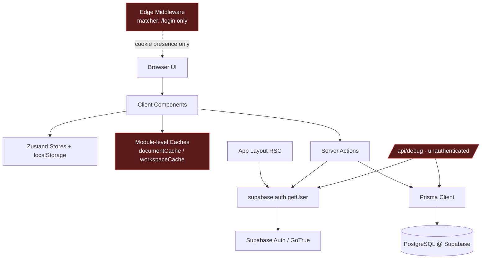

# PromptHub
## Platform Technical Review and Analysis

| `Title` | `Created` | `Last modified` |
|---------|-----------|-----------------|
| Platform Technical Review and Analysis | 08/07/2026 09:00 GMT+10 | 08/07/2026 09:35 GMT+10 |

## Table of Contents
- [Scope and Method](#scope-and-method)
- [Remediation Status (08/07/2026)](#remediation-status-08072026)
- [Executive Summary](#executive-summary)
- [Architecture Overview](#architecture-overview)
- [Findings Register (Ranked)](#findings-register-ranked)
- [Security Findings](#security-findings)
- [Architectural Findings](#architectural-findings)
- [Data Model and Persistence Findings](#data-model-and-persistence-findings)
- [Frontend and State Findings](#frontend-and-state-findings)
- [Quality, Process, and Hygiene Findings](#quality-process-and-hygiene-findings)
- [What Is Done Well](#what-is-done-well)
- [Prioritised Remediation Plan](#prioritised-remediation-plan)
- [Appendix: Evidence Index](#appendix-evidence-index)

---

## Scope and Method

This review is based on direct inspection of the application source, Prisma schema
and migrations, runtime configuration (`next.config.mjs`, `tsconfig.json`,
`package.json`), the Supabase/Prisma integration layer, all server actions, the
editor and tab subsystems, and recent git history on branch
`claude/platform-technical-review-hv58vu` (base commit `51db272`).

It supersedes and updates the earlier `docs/review/project-review-overview-20260308.md`,
which predates commit `dd48322` ("feat: implement high-priority integrations for
history, tags, and search"). Several items that document marked "Not integrated"
(tagging, search, version history) are now wired in and are re-assessed here against
their current implementation.

Where a claim could not be verified to 100% certainty from the source, it is stated
as a candidate and the verification step is named. No runtime deployment or live
database was inspected; findings that depend on deployment configuration
(specifically the Prisma database role) are flagged as such.

---

## Remediation Status (08/07/2026)

The findings below were acted on in the same branch immediately after the review.
Fixes were verified with `npm run lint`, `npx tsc --noEmit`, `npm test` (29 tests),
`npx prisma validate`, and a full `npm run build` (all green). Items requiring a live
database or full browser-driven UI validation were deferred (see rationale) rather than
changed blind.

| # | Finding | Status | Notes |
|---|---------|--------|-------|
| F1 | RLS untracked / bypassed by Prisma | **Docs corrected** | Docs now state app-layer filtering is the authoritative, enforced boundary and RLS is optional defence-in-depth. Making RLS a tracked migration (Option B) deferred — needs live DB + a decision to route reads through the JWT. |
| F2 | Unauthenticated `/api/debug` | **Fixed** | Route deleted. |
| F3 | Committed credentials | **Fixed (rotate pending)** | Secrets removed from `docs/rules/archon.md` and `docs/rules/testing.md`. The exposed credentials must still be **rotated** by an owner (they remain in git history). |
| F4 | Dead / unindexed FTS | **Fixed** | `content_tsv` is now a STORED generated column (migration `20260708000000`); search uses `content_tsv @@ to_tsquery(...)` so the GIN index is live. Requires `prisma migrate deploy` against the DB. |
| F5 | Fragile editor state model | **Deferred** | A TanStack Query/SWR refactor of `EditorPane` is 2–4 days and must be validated in a running browser; doing it blind risks regressing the save path. Tracked for a dedicated PRP. |
| F6 | Missing security headers / rate limiting | **Partially fixed** | Security headers (CSP, HSTS, X-Frame-Options, X-Content-Type-Options, Referrer-Policy, Permissions-Policy) added in `next.config.mjs`. Rate limiting deferred (needs an external store, e.g. Upstash). CSP should be validated in-browser against Monaco. |
| F7 | Duplicated Supabase client factories | **Fixed** | `src/lib/supabase.ts` deleted; all imports consolidated onto `@/lib/supabase/server` and `@/lib/supabase/client`. |
| F8 | Ownership-check-then-unscoped write | **Fixed** | `renamePrompt` and `saveNewVersion` now use single-statement `updateMany({ where: { id, user_id }})`. |
| F9 | Unbounded workspace preload | **Deferred** | Pagination/lazy-load changes runtime behaviour of the preloader and cache; requires UI validation. Tracked. |
| F10 | Contradictory version storage | **Deferred** | Dropping `diff` is a data-model change; snapshots-only recommended but deferred to a migration PRP. |
| F11 | No content length cap | **Fixed** | `MAX_CONTENT_LENGTH` (500k) enforced in `saveNewVersionSchema` and `autoSaveSchema`. |
| F12 | No tests / no CI | **Fixed** | Vitest added with 29 unit tests (diff-utils, prompt/editor/auth schemas, display helper); GitHub Actions CI runs lint, typecheck, test, build, Prisma validate, and gitleaks secret scan. |
| F13 | Docs / version drift | **Fixed** | `CLAUDE.md`, `docs/rules/project.md`, and `README.md` corrected (Next 14.2.35 App Router; accurate isolation model; real RLS file path; removed the forbidden `auth.users` trigger instruction; dev port 3010). |
| F14 | Dead / stray files | **Fixed** | Removed unused `components/Header.tsx`, publicly-routable `pages/test-editor.tsx`, committed `npm_output.log`; consolidated the duplicate `ensureProfileExists`; hardened `.gitignore`. |
| F15 | Case-insensitive dedupe vs case-sensitive constraint | **Deferred** | Needs a `lower(name)` unique index migration; low severity, tracked. |
| F16 | Stale session-refresh comments | **Fixed** | Comments in `src/lib/supabase/server.ts` corrected to reflect the post-504-fix reality. |

**Net:** 10 of 16 findings fixed, 1 partially fixed, 5 deferred with rationale. The
deferred items are the ones that cannot be safely completed without a live
database/deployment or that constitute a multi-day refactor best done as its own
tracked unit of work.

---

## Executive Summary

PromptHub is a competently scaffolded Next.js App Router application with a clean
feature-folder layout, consistent server-action patterns, Zod validation at every
action boundary, and per-user `WHERE user_id` filtering on every data query. The
core CRUD, tabbed editing, autosave, tagging, search, and version-history flows are
implemented and integrated.

However, the platform has **structural weaknesses that block a confident production
release**:

1. **The security model is dual and contradictory.** Row-Level Security (RLS) exists
   only as an untracked hand-run SQL script in `wip/`, is absent from migrations, and
   is bypassed entirely by Prisma. Real tenant isolation rests solely on
   application-level `user_id` filters. The RLS layer provides a false sense of
   defence-in-depth that is neither reproducible nor actually in the request path.
2. **An unauthenticated debug endpoint** (`/api/debug`) leaks infrastructure details
   and a global row count.
3. **Full-text search is unindexed and partly dead.** The `content_tsv` column and its
   GIN index are never populated; the search query recomputes `to_tsvector()` inline,
   forcing a sequential scan.
4. **The editor's client-side state model is fragile.** `EditorPane.tsx` (704 lines)
   carries 7+ imperative guard refs and repeated "CRITICAL data-destruction /
   cache-contamination" patches over module-level mutable caches — a symptom of an
   unsound concurrency design rather than isolated bugs.
5. **No automated tests and no CI**, despite project rules mandating 80%+ TDD coverage.
6. **Committed credentials** exist in `docs/rules/` and `docs/rules/testing.md`.

None of these are unusual for a fast-moving MVP, but each is a genuine liability. The
remediation plan at the end sequences them by risk and effort.

---

## Architecture Overview

**Request/trust flow:** Every server action independently calls
`supabase.auth.getUser()` and then filters Prisma queries by `user_id`. Prisma
connects over `DATABASE_URL`/`DIRECT_URL` (Supabase Postgres). RLS policies, if
applied at all, do not constrain Prisma because Prisma authenticates as a database
role, not as the end user's JWT. Therefore **the only enforced isolation boundary is
the application code**, and every action must get its filter right, every time.

---

## Findings Register (Ranked)

| # | Severity | Area | Finding | Primary Evidence |
|---|----------|------|---------|------------------|
| F1 | Critical | Security | RLS defined only in untracked `wip/` SQL, absent from migrations, bypassed by Prisma | `wip/P3S1-rls-policies.sql`; `prisma/migrations/*` |
| F2 | High | Security | Unauthenticated `/api/debug` leaks DB host:port, global folder count, auth email, env presence | `src/app/api/debug/route.ts` |
| F3 | High | Security | Committed credentials in project docs | `docs/rules/archon.md`; `docs/rules/testing.md` |
| F4 | High | Performance | FTS column/index never populated; search does inline `to_tsvector` seq scan | `src/features/prompts/actions.ts:585`; `prisma/schema.prisma` |
| F5 | High | Frontend | Fragile editor concurrency model; module-level mutable caches; data-destruction history | `src/features/editor/components/EditorPane.tsx` |
| F6 | Medium | Security | No security headers (CSP/HSTS/X-Frame-Options), no rate limiting | `next.config.mjs` |
| F7 | Medium | Architecture | Duplicated Supabase client factories with inconsistent usage | `src/lib/supabase.ts` vs `src/lib/supabase/server.ts` |
| F8 | Medium | Correctness | Ownership check then unscoped update (TOCTOU) in `renamePrompt`/`saveNewVersion` | `src/features/prompts/actions.ts:463`; `src/features/editor/actions.ts:982` |
| F9 | Medium | Scalability | `getWorkspaceSnapshot` loads all folders + all prompt content unbounded on launch | `src/features/workspace/actions.ts` |
| F10 | Medium | Data model | Version storage is contradictory: stores both `diff` and full snapshots; `diff` now dead | `prisma/schema.prisma`; `src/features/prompts/actions.ts:855` |
| F11 | Medium | Security/DoS | No length cap on `content` (Zod `z.string()` unbounded) | `src/features/editor/schemas.ts` |
| F12 | Medium | Process | Zero automated tests; no CI; docs mandate 80% TDD | repo-wide; `docs/rules/testing.md` |
| F13 | Low | Docs/Config | Version drift (Next 14.2.35 vs 14.2.3 vs "15/React 19"); README references non-existent SQL and forbidden `auth.users` trigger | `package.json`; `README.md`; `docs/rules/project.md` |
| F14 | Low | Hygiene | Dead/stray files: unused `components/Header.tsx`, `pages/test-editor.tsx` (publicly routable), committed `npm_output.log` | see body |
| F15 | Low | Correctness | Case-insensitive tag/title dedupe in app but case-sensitive DB constraint → race duplicates | `src/features/prompts/actions.ts:676` |
| F16 | Low | Correctness | Stale middleware/session-refresh comments after edge network-call removal | `src/lib/supabase/server.ts`; `src/middleware.ts` |

---

## Security Findings

### F1 — Contradictory security model: RLS is not really in the request path (Critical)

The README and `docs/rules/project.md` present RLS as the isolation mechanism
("RLS policies enforce multi-tenancy"). In reality:

- No migration in `prisma/migrations/` enables RLS or creates any policy
  (`grep` for `row level security`/`policy` returns nothing in `prisma/`).
- The only policy definitions live in `wip/P3S1-rls-policies.sql`, a document that
  must be pasted into the Supabase SQL editor by hand. It is not versioned with the
  schema, not part of `prisma migrate`, and cannot be reproduced by a fresh
  environment or CI.
- Even if applied, RLS constrains connections that carry the end user's JWT
  (the Supabase client). **All application data access goes through Prisma**, which
  connects with a database role over `DATABASE_URL`. That role is not subject to the
  user's `auth.uid()`, so RLS does not filter Prisma queries.

**Consequence:** tenant isolation depends entirely on every server action correctly
applying `WHERE user_id = user.id`. Today they do, but there is no second line of
defence. A single missed filter in a future action is a full cross-tenant data
breach. The current design gives the *appearance* of defence-in-depth without the
substance.

**Recommendations (choose one and make it real):**
- **Option A (keep Prisma authoritative):** Delete the RLS narrative from user-facing
  docs, and instead enforce isolation structurally — e.g. a thin repository layer that
  refuses any query without a `user_id` predicate, plus tests that assert cross-user
  access returns empty. Treat app-level filtering as the *sole, tested* boundary.
- **Option B (make RLS real):** Move `P3S1-rls-policies.sql` into a tracked Prisma
  migration, and route user data reads/writes through the Supabase client (or run
  Prisma through the Supabase connection with the JWT set via
  `SET LOCAL request.jwt.claims`). This is a larger change but restores true
  defence-in-depth.

Do not leave the current half-state.

### F2 — Unauthenticated debug endpoint (`/api/debug`) (High)

`src/app/api/debug/route.ts` is a public `GET` with no auth check. It returns:
- `DATABASE_URL`/`DIRECT_URL` **host:port** (via regex extraction),
- presence of Supabase URL/anon key,
- `db.folder.count()` — a **global** count across *all* users, and
- the currently authenticated user's email (if any).

This leaks infrastructure topology and a global usage metric to anyone. Remove the
route, or gate it behind an admin check and `process.env.NODE_ENV !== 'production'`.
At minimum it must not run in production.

### F3 — Committed credentials in the repository (High)

- `docs/rules/archon.md` contains a plaintext `{ "identity": ..., "password": ... }`
  block.
- `docs/rules/testing.md` embeds a primary test-user email and password.

Credentials in VCS are exposed to anyone with repo access and persist in history even
after deletion. Rotate the affected credentials, remove the secrets from the files,
and move test logins to an untracked `.env.test` / secret store. Add a secret-scanning
step (see F12).

### F6 — Missing security headers and rate limiting (Medium)

`next.config.mjs` configures only the Monaco webpack plugin. There is no `headers()`
function, so the app ships without CSP, HSTS, `X-Frame-Options`,
`X-Content-Type-Options`, or `Referrer-Policy`. There is also no rate limiting on
authentication (`signIn`/`signUp`) or on write actions, leaving them open to
credential-stuffing and abuse. Add a `headers()` block (start with a strict CSP that
accommodates Monaco's web workers) and rate-limit auth/mutation actions (Upstash
Ratelimit or Supabase edge equivalent).

---

## Architectural Findings

### F7 — Two Supabase client factories, used inconsistently (Medium)

There are two server-client implementations with different names and near-identical
bodies:

- `src/lib/supabase.ts` → `createServer()` and a browser `createClient()`
- `src/lib/supabase/server.ts` → `createClient()` and `src/lib/supabase/client.ts`

Usage is split roughly by author/era: `folders`, `profile`, `workspace`, the app
layout, and `/api/debug` use `@/lib/supabase#createServer`; `prompts`, `editor`,
`dashboard`, `auth`, and the header use `@/lib/supabase/server#createClient`. This is a
direct SSOT/DRY violation and a maintenance trap — a fix to cookie handling or session
refresh must be applied in two places. Consolidate to a single `server.ts`/`client.ts`
pair and delete `src/lib/supabase.ts`.

### F9 — Unbounded workspace preload (Medium)

`getWorkspaceSnapshot()` fetches **every** folder and **every** prompt *including full
`content`* for the user in one call, run on app launch by `WorkspacePreloader`. For a
"GitHub for prompts" product this is the hot path that will not scale: a user with a
few thousand prompts downloads their entire corpus (and re-parses it into module-level
maps) on every cold load. Introduce pagination / lazy folder expansion, and fetch
prompt `content` only when a document is opened (list views need only `id`, `title`,
`folder_id`, `updated_at`).

### F16 — Stale session-refresh assumptions (Low)

Both server clients contain the comment "This can be ignored if you have middleware
refreshing user sessions." After commit `e701d51` ("remove Supabase network calls from
edge middleware", the Vercel 504 fix), the middleware (`src/middleware.ts`) only
matches `/login` and does a cookie-name presence check — it does **not** refresh
sessions. Token refresh now relies solely on the client SDK. The comments are
misleading and the assumption they encode is no longer true. Either restore a
lightweight session refresh in middleware (without the blocking network call that
caused the 504) or update the comments to reflect reality.

---

## Data Model and Persistence Findings

### F4 — Full-text search is unindexed and half-dead (High)

The schema declares `content_tsv Unsupported("tsvector")?` with a GIN index
(`prisma/schema.prisma`), and the original migration creates
`Prompt_content_tsv_idx`. **Nothing ever populates `content_tsv`** — there is no
trigger, no generated column, and no write path sets it (autosave/save write only
`title`/`content`). So:

- The `content_tsv` column is always `NULL` and the GIN index indexes nothing — pure
  write/storage overhead.
- `searchPrompts` (`src/features/prompts/actions.ts:585`) computes
  `to_tsvector('english', coalesce(title,'') || ' ' || coalesce(content,''))` **inline
  at query time**, which cannot use the index and forces a full sequential scan with
  per-row tsvector computation. It then `ORDER BY updated_at DESC` (no supporting
  index) and `LIMIT 100`.

**Fix:** make `content_tsv` a Postgres **generated column**
(`GENERATED ALWAYS AS (to_tsvector('english', coalesce(title,'')||' '||coalesce(content,''))) STORED`),
keep the GIN index, and change the query to `WHERE content_tsv @@ to_tsquery(...)`.
This makes the existing index live and turns search from O(n) into an index scan.
Track the change as a real migration.

### F10 — Version storage contradicts its own design (Medium)

`PromptVersion` stores a `diff` (diff-match-patch patch) **and**, since migration
`20260308030000`, full `title_snapshot` + `content_snapshot`. The README advertises
"diff-based versioning system" for "efficient storage… rather than storing full
content for every version." In practice:

- `saveNewVersion` writes both the diff and a full snapshot of the *previous* content.
- `restorePromptVersion` uses only the snapshots; `applyPatch` in `diff-utils.ts` is
  never called in the runtime restore path.

The result is the worst of both worlds: full-content storage cost **plus** a now-dead
`diff` field. Decide the model: either (a) snapshots only — drop `diff` and simplify,
or (b) true diff chains — reconstruct via `applyPatch` and stop storing full snapshots.
Given prompts are small text and snapshots are simplest/most robust, option (a) is
recommended; remove `diff` and the unused `applyPatch` code.

### F11 — No content length limit (Medium)

`saveNewVersionSchema.newContent` and `autoSaveSchema.content` are `z.string()` with no
`.max()`. `Prompt.content` is unbounded `TEXT`. A client can persist arbitrarily large
payloads, and every autosave writes the full content plus (on manual save) a full
snapshot. Add a sane cap (e.g. 100–500 KB) in the Zod schemas and reject oversize
input early.

### F15 — Case-insensitive dedupe vs case-sensitive constraint (Low)

Tag creation and prompt renaming check duplicates with Prisma
`mode: 'insensitive'`, but the DB uniqueness is the case-sensitive
`Tag_name_user_id_key` (and prompt titles have no DB constraint at all). Under
concurrency, two requests can both pass the `findFirst` check and create
`work` / `Work`. Either make the constraint case-insensitive (unique index on
`lower(name)`) or accept the app-level check as best-effort and handle the unique
violation.

---

## Frontend and State Findings

### F5 — The editor state model is fragile (High)

`src/features/editor/components/EditorPane.tsx` (704 lines, well over the project's
500-line rule) is the riskiest file in the codebase. It coordinates: Monaco, a
debounced autosave, a manual version save, a tab system, `localStorage` drafts, and a
**module-level mutable `documentCache` Map**. To keep these consistent it uses at least
seven imperative guard refs — `loadedRef`, `contentPromptIdRef`, `promptIdRef`,
`isTransitioning`, `monacoPromptIdRef`, `titlePromptIdRef` — plus `AbortController`
plumbing, and the module executes `documentCache.clear()` at import time.

The comment trail (`P5S5 data destruction fix`, `cache contamination fix`,
`stale saves`, `P0T1/P0T2/P0T3`) and the `wip/` history
(`P5S5-data-destruction-investigation-CRITICAL.md`,
`investigation-cache-contamination-evidence.png`, `infinite-loop-fix-summary.md`)
show a recurring class of bugs where the wrong document's content was saved over
another. Each was patched with another ref guard. This is a design smell: **manual
ref-based synchronisation of shared mutable state is being used where a keyed,
declarative data layer belongs.**

**Recommendation:** replace the bespoke cache + ref guards with a query/mutation
library keyed by `promptId` (TanStack Query or SWR). Keying cache entries and mutations
by document id structurally eliminates cross-document contamination and stale-save
races, and lets `EditorPane` shrink to view logic. This is the single highest-leverage
refactor for reliability.

### F8 — Ownership check then unscoped write (Medium)

Several actions read to verify ownership, then update by primary key only:

- `renamePrompt` verifies via `findFirst({ id, user_id })` then
  `db.prompt.update({ where: { id: promptId } })` — no `user_id` on the update.
- `saveNewVersion` verifies `findFirst({ id, user_id })` then updates
  `where: { id: promptId }` inside the transaction.

By contrast `autoSavePrompt` and `deletePrompt` correctly use
`updateMany`/`deleteMany` with `{ id, user_id }` in a single statement. The
check-then-act pattern is a time-of-check/time-of-use gap and inconsistent with the
safer siblings. Standardise on single-statement `updateMany({ where: { id, user_id }})`
and treat `count === 0` as "not found or denied".

### Module-level mutable singletons (contributes to F5/F9)

`workspaceCache` (`src/features/workspace/cache.ts`) and `documentCache`
(`EditorPane.tsx`) are module-scoped mutable objects. They are currently imported only
by client components, so today they are per-browser and not a server leak. But nothing
enforces that: a single future `import` from a Server Component turns them into a
cross-request, cross-user cache on the server. They also mutate outside React's
lifecycle, so they don't trigger re-renders and can desync from component state. Prefer
a store (Zustand, which the project already uses) or the query cache from the F5
recommendation, and add an ESLint boundary to prevent server imports.

---

## Quality, Process, and Hygiene Findings

### F12 — No automated tests, no CI (Medium)

`docs/rules/testing.md` and `CLAUDE.md` mandate TDD and 80%+ coverage. There are **no**
test files (`*.test.*` / `*.spec.*`) in the repo; "testing" is a set of manual
markdown reports under `wip/`. There is also no `.github/workflows` — lint, typecheck,
and build are not enforced on push. Given the concurrency bugs in F5, the absence of
tests is the root process gap. Add:
- Unit tests for `diff-utils`, schema validation, and each server action's
  authz/isolation behaviour (assert cross-user access returns empty/denied).
- A CI workflow running `next lint`, `tsc --noEmit`, `prisma validate`, `next build`,
  and secret scanning on every PR.

### F13 — Documentation and configuration drift (Low)

- **Version drift:** `package.json` pins `next@14.2.35`; `CLAUDE.md` says `14.2.3`;
  `docs/rules/project.md` claims "Next.js 15 + React 19". `npm_output.log` shows
  `14.2.3`. Pick the truth and make the docs match `package.json`.
- **README setup is wrong/dangerous:** it instructs running
  `wip/T2.1-supabase-profile-trigger.sql` and `wip/T3.1-rls-policies.sql` — neither
  path exists (the actual RLS file is `wip/P3S1-rls-policies.sql`), and it tells users
  to create a trigger on `auth.users`, which both `CLAUDE.md` and Supabase Cloud
  explicitly forbid. Profile creation is in fact handled in application code
  (`ensureProfileExists`). Rewrite the README setup to match reality.

### F14 — Dead and stray files (Low)

- `src/components/Header.tsx` is **not imported anywhere** (the app uses
  `src/components/layout/Header.tsx`) — dead code; remove it.
- `src/pages/test-editor.tsx` is a Pages-Router demo page in an App-Router project. It
  is **publicly routable at `/test-editor`** in production. Delete it or guard it.
- `npm_output.log` is committed build noise; remove and add to `.gitignore`.
- Two `ensureProfileExists` implementations exist (`src/lib/ensure-profile.ts` and an
  inline copy in `auth/actions.ts`); consolidate to the shared one.

---

## What Is Done Well

To keep the assessment fair and realistic, the following are genuine strengths:

- **Consistent action contract:** almost every server action validates input with Zod,
  authenticates with `getUser()`, filters by `user_id`, and returns a typed
  `ActionResult`. The pattern is easy to reason about.
- **`getUser()` over `getSession()`** for authorization decisions (the former verifies
  with the auth server), used correctly in the data actions and layout.
- **Parameterised raw SQL** in `searchPrompts` — user input is bound, not interpolated,
  and the ts-query tokens are sanitised against a Unicode allowlist.
- **Atomic version+update transactions** in `saveNewVersion` and
  `restorePromptVersion`.
- **Feature-folder modularity** (`src/features/*`) with clear separation of actions,
  schemas, components, and hooks.
- **Sensible indexing** on `(user_id, folder_id)` and `(user_id, parent_id)` for the
  common list queries.
- **Prisma singleton** guarded for dev HMR (`src/lib/db.ts`).

---

## Prioritised Remediation Plan

| Priority | Action | Findings | Est. Effort (1 FTE) |
|----------|--------|----------|---------------------|
| P0 | Remove/gate `/api/debug`; rotate & remove committed credentials | F2, F3 | 1–2 hours |
| P0 | Decide and make-real the isolation model (Option A tested app-layer, or Option B tracked RLS) | F1 | 1–3 days |
| P1 | Make `content_tsv` a generated column + index-driven search migration | F4 | 3–5 hours |
| P1 | Refactor `EditorPane` onto TanStack Query/SWR keyed by `promptId`; delete module caches | F5, singletons | 2–4 days |
| P1 | Add CI (lint/typecheck/build/prisma validate/secret scan) + first authz/isolation tests | F12 | 1–2 days |
| P2 | Add security headers + rate limiting | F6 | 4–8 hours |
| P2 | Consolidate Supabase client factories | F7 | 2–3 hours |
| P2 | Standardise ownership-scoped writes (`updateMany` with `user_id`) | F8 | 2–3 hours |
| P2 | Paginate/lazy-load workspace; drop `content` from list fetch | F9 | 1 day |
| P2 | Resolve version-storage model (snapshots-only recommended); drop dead `diff`/`applyPatch` | F10 | 4–8 hours |
| P3 | Add content length caps in Zod | F11 | 1 hour |
| P3 | Fix README setup, version drift; remove dead/stray files | F13, F14 | 2–4 hours |
| P3 | Case-insensitive uniqueness for tags/titles | F15 | 2–3 hours |
| P3 | Fix stale session-refresh comments / restore lightweight refresh | F16 | 1–2 hours |

---

## Appendix: Evidence Index

| Finding | Files / Locations |
|---------|-------------------|
| F1 | `wip/P3S1-rls-policies.sql`; `prisma/migrations/` (no RLS); `src/lib/db.ts`; all `*/actions.ts` |
| F2 | `src/app/api/debug/route.ts` |
| F3 | `docs/rules/archon.md`; `docs/rules/testing.md` |
| F4 | `prisma/schema.prisma` (`content_tsv`, GIN index); `src/features/prompts/actions.ts:562-629` |
| F5 | `src/features/editor/components/EditorPane.tsx:76-259`; `wip/P5S5-data-destruction-investigation-CRITICAL.md` |
| F6 | `next.config.mjs`; `src/features/auth/actions.ts` |
| F7 | `src/lib/supabase.ts`; `src/lib/supabase/server.ts`; `src/lib/supabase/client.ts` |
| F8 | `src/features/prompts/actions.ts:417-481`; `src/features/editor/actions.ts:923-1004` |
| F9 | `src/features/workspace/actions.ts`; `src/components/layout/WorkspacePreloader.tsx` |
| F10 | `prisma/schema.prisma` (`PromptVersion`); `src/features/prompts/actions.ts:815-883`; `src/lib/diff-utils.ts` |
| F11 | `src/features/editor/schemas.ts` |
| F12 | repo-wide (no tests, no `.github/workflows`) |
| F13 | `package.json`; `README.md`; `docs/rules/project.md`; `npm_output.log` |
| F14 | `src/components/Header.tsx`; `src/pages/test-editor.tsx`; `npm_output.log` |
| F15 | `src/features/prompts/actions.ts:663-707`; migration `20251108111348` |
| F16 | `src/lib/supabase/server.ts`; `src/middleware.ts`; commit `e701d51` |

---

**Report Status**: FINAL
**Scope**: Full platform technical review (security, architecture, data model, frontend, process)
**Base Commit**: 51db272 (branch `claude/platform-technical-review-hv58vu`)
**Supersedes**: docs/review/project-review-overview-20260308.md (pre-`dd48322`)
**Method**: Static source inspection; no live deployment/database inspected
