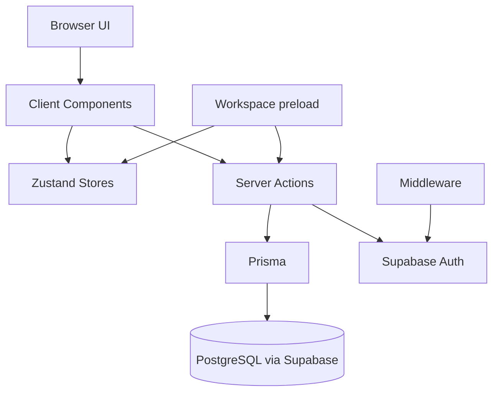

# PromptHub
## Definitive Project Review Overview

| `Title` | `Created` | `Last modified` |
|---------|-----------|-----------------|
| Definitive Project Review Overview | 08/03/2026 12:20 GMT+10 | 08/03/2026 12:20 GMT+10 |

## Table of Contents
- [Scope and method](#scope-and-method)
- [Workspace inventory](#workspace-inventory)
- [Runtime architecture](#runtime-architecture)
- [Feature implementation matrix](#feature-implementation-matrix)
- [Configuration and environment status](#configuration-and-environment-status)
- [Data model and migration status](#data-model-and-migration-status)
- [Testing and quality status](#testing-and-quality-status)
- [Git and planning document findings](#git-and-planning-document-findings)

## Scope and method
This review was produced from direct inspection of application source, project docs, plan and report docs, migrations, runtime configuration files, and recent git history. The review includes an integration audit to identify implemented-but-not-integrated systems and legacy or ghost code candidates.

## Workspace inventory
- Application framework: Next.js App Router with one additional Pages Router test page (`src/pages/test-editor.tsx`).
- Frontend systems: shadcn-ui primitives, Radix components, Monaco editor wrapper, Zustand stores, dnd-kit tab interactions.
- Backend systems: Next.js Server Actions with Prisma client and Supabase auth/session checks.
- Database: Prisma schema and four migrations in `prisma/migrations`.
- Documentation and planning: `docs/project`, `docs/plans`, `docs/rules`, `PRPs`, and `wip` contain extensive implementation history and memory-style summaries.

## Runtime architecture

Core runtime flow:
- Authentication is checked by middleware and route-level auth checks.
- Main app layout mounts folder tree, document list, and tabbed editor in a responsive panel shell.
- Document editing runs through Monaco with autosave and explicit version-save actions.
- Client-side workspace cache reduces repeated folder and prompt fetches.

## Feature implementation matrix
| Feature/System | Current state | Integration status | Evidence summary |
|---|---|---|---|
| Auth (sign in, sign up, sign out) | Implemented | Integrated | Auth form and server actions wired into login and header flows |
| Folder CRUD | Implemented | Integrated | Folder tree and dialogs call folder server actions |
| Prompt CRUD | Implemented | Integrated | Prompt list and toolbar call prompt actions |
| Tabbed editor | Implemented | Integrated | Tabs, drag sort, preview tab behavior, migration hook |
| Manual version save | Implemented | Integrated | `saveNewVersion` action and save UI path in editor pane |
| Autosave | Implemented | Integrated | Debounced autosave action and editor synchronization |
| Version history UI | Placeholder only | Not integrated | Header button emits “coming soon” toast only |
| Tagging (schema-level) | Data model exists | Not integrated | No tag server actions or UI/tag filters in runtime |
| Full-text search (schema-level) | Data field/index exists | Not integrated | No search action/query path using `content_tsv` |
| Split-pane tab layout model | Type/store scaffolding exists | Not integrated | `splitPane` and `closePane` are TODO placeholders |
| Workspace preload cache | Implemented | Integrated | Snapshot action and cache hydration path exist |
| Debug endpoint | Implemented | Integrated but environment-sensitive | `/api/debug` route available in app runtime |

## Configuration and environment status
- Environment template exists as `.env.example` with Supabase and Prisma variables.
- Next build depends on external font fetch from Google (`Inter` via `next/font/google`) and can fail in restricted network environments.
- Monaco self-hosting is configured through webpack plugin and postinstall copy script.
- Tailwind and shadcn configuration are present and consistent with CSS-variable theme usage.

## Data model and migration status
- Prisma models include `Profile`, `Folder`, `Prompt`, `PromptVersion`, and `Tag` with relations and indexes.
- Prompt full-text support is prepared (`content_tsv` plus GIN index) but query-layer usage is absent.
- Tag relation model is present but not surfaced in action/component layer.
- Migrations indicate incremental schema fixes for profile schema, nullable prompt title, and tag uniqueness.

## Testing and quality status
- No dedicated unit or integration test suite is present in repository scripts.
- Linting runs clean.
- Build fails in this environment due to remote font fetch restriction, not code compile/type errors in inspected path.

## Git and planning document findings
- Recent commits show active work on responsive layout, tab behavior, and deployment fixes.
- `PRPs/project-review-and-next-steps.md` is outdated relative to current codebase and still describes earlier missing features that are now implemented.
- Multiple `wip` and PRP report documents indicate historical context and prior investigations; these should be treated as historical logs, not authoritative current-state references.
