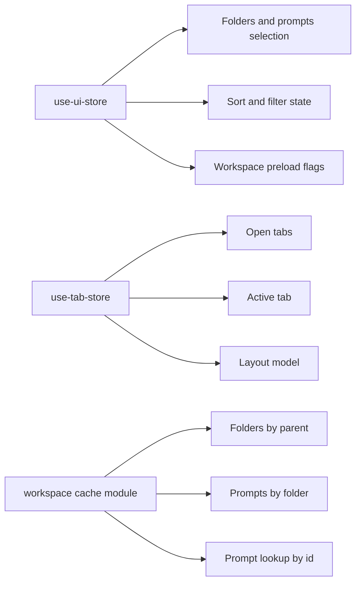

# PromptHub
## Source Module and System Map

| `Title` | `Created` | `Last modified` |
|---------|-----------|-----------------|
| Source Module and System Map | 08/03/2026 12:20 GMT+10 | 08/03/2026 12:20 GMT+10 |

## Table of Contents
- [Application entry and routing](#application-entry-and-routing)
- [State layers](#state-layers)
- [Feature modules](#feature-modules)
- [Shared libraries](#shared-libraries)
- [Configuration files](#configuration-files)
- [Known hotspots](#known-hotspots)

## Application entry and routing
- Root layout: theme provider, global styles, and toast provider.
- Auth route group: login page and auth form.
- App route group: authenticated workspace shell, dashboard, profile, settings.
- Middleware enforces public and protected route behavior with Supabase session checks.
- Additional routes:
  - `/api/debug` diagnostics route.
  - `/auth/sign-out` route handler (currently secondary path).
  - `/test-editor` Pages Router test page for Monaco verification.

## State layers

- `use-ui-store`: folder and prompt selection, sort/filter controls, and prompt list state.
- `use-tab-store`: tab lifecycle, preview behavior, drag reorder, close/confirm semantics, partial persistence.
- Workspace cache: memory cache of folder and prompt snapshots for fast navigation.

## Feature modules
- `features/auth`: zod schemas, auth form UI, and server actions.
- `features/folders`: tree rendering, per-folder actions, and folder dialog set.
- `features/prompts`: prompt list and toolbar workflows, prompt CRUD actions, title handling.
- `features/editor`: Monaco wrapper, editor pane orchestration, autosave/manual save actions, markdown action registry.
- `features/tabs`: tab bar and tab content routing for document/system tabs.
- `features/workspace`: snapshot server action and cache helpers for preload and optimistic updates.
- `features/dashboard` and `features/profile`: account-centric pages and actions.

## Shared libraries
- `lib/supabase.ts` plus `lib/supabase/server.ts` and `lib/supabase/client.ts` provide environment-specific clients.
- `lib/db.ts` centralizes Prisma singleton.
- `lib/diff-utils.ts` encapsulates patch creation and patch application.
- `lib/ensure-profile.ts` provides profile existence guard utility.

## Configuration files
- `package.json`: Next/Prisma scripts and Monaco postinstall copy.
- `next.config.mjs`: Monaco webpack plugin and worker packaging.
- `tailwind.config.ts`, `postcss.config.mjs`, `components.json`: UI stack configuration.
- `.env.example`: required Supabase and Prisma variables.
- `prisma/schema.prisma`: source of truth for relational model.

## Known hotspots
- `features/editor/components/EditorPane.tsx` is above 500 lines and central to content integrity and autosave synchronization.
- `features/prompts/actions.ts` and `features/prompts/components/PromptList.tsx` carry many responsibilities and are frequent integration points.
- `stores/use-tab-store.ts` includes partially implemented split-pane APIs that can create expectation drift unless marked clearly in product docs.
