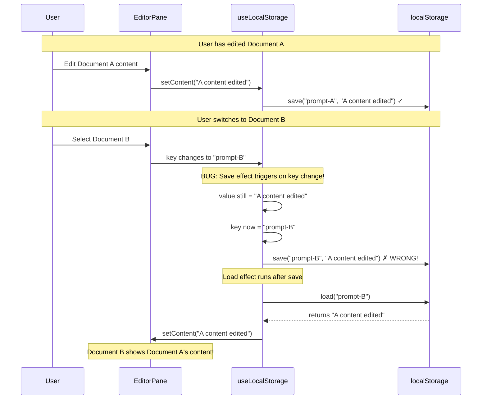

# PromptHub
## P5S4bT1 - Critical Bug Fix Analysis

| `Title` | `Created` | `Last modified` |
|---------|-----------|-----------------|
| P5S4bT1 - Critical Bug Fix Analysis | 08/11/2025 12:24 GMT+10 | 08/11/2025 12:24 GMT+10 |

## Table of Contents
- [Executive Summary](#executive-summary)
- [Root Cause Analysis](#root-cause-analysis)
- [The Bug Mechanism](#the-bug-mechanism)
- [Solution Implementation](#solution-implementation)
- [Testing Instructions](#testing-instructions)
- [Technical Details](#technical-details)

## Executive Summary

**Issue**: Selecting different documents displayed the same content (wrong document content)

**Root Cause**: The `useLocalStorage` hook was saving the OLD document's content to the NEW document's localStorage key during document switches.

**Fix Location**: `src/features/editor/hooks/useLocalStorage.ts` (NOT EditorPane.tsx)

**Fix Type**: Added ref-based guard to prevent save effect from triggering during key changes

**Status**: Fixed and ready for testing

## Root Cause Analysis

### Initial Misdiagnosis

The PRP document (P5S4b) identified the issue in `EditorPane.tsx` and suggested adding a cleanup effect to reset content when `selectedPrompt` changes. **This was treating the symptom, not the root cause.**

### Actual Root Cause

The bug was in `useLocalStorage.ts` lines 71-75:

```typescript
// BUG: This effect triggers on BOTH key AND value changes
useEffect(() => {
  if (typeof window !== 'undefined') {
    localStorage.setItem(key, value)
  }
}, [key, value])  // ← key in deps array causes save on document switch!
```

### Why This Caused Wrong Content

When `key` is in the dependency array, the effect runs when the key changes (document switch). At that moment:
- **value** still contains the OLD document's content
- **key** has changed to the NEW document's ID
- **Result**: OLD content saved to NEW document's localStorage key

## The Bug Mechanism



## Solution Implementation

### Fix Strategy

Use a ref to track the previous key. Skip the save effect if the key just changed (we're loading, not saving).

### Code Changes

**File**: `src/features/editor/hooks/useLocalStorage.ts`

**Changes**:
1. Added `useRef` import
2. Created `prevKeyRef` to track previous key
3. Updated save effect to skip when key just changed
4. Updated load effect to set ref AFTER loading

**Key Code**:
```typescript
// Track previous key
const prevKeyRef = useRef<string>(key)

// Load effect updates ref AFTER loading
useEffect(() => {
  if (typeof window !== 'undefined') {
    const saved = localStorage.getItem(key)
    setValue(saved || initialValue)
  }
  prevKeyRef.current = key  // ← Update ref after load
}, [key, initialValue])

// Save effect checks ref before saving
useEffect(() => {
  // Skip save if key just changed
  if (prevKeyRef.current !== key) {
    return  // ← Guard: we're loading, not saving
  }

  if (typeof window !== 'undefined') {
    localStorage.setItem(key, value)
  }
}, [key, value])
```

### Why This Works

**On Document Switch** (key changes):
1. Load effect runs → loads new document from localStorage → updates `prevKeyRef`
2. Save effect runs → sees `prevKeyRef !== key` → skips save ✓

**On Content Edit** (value changes, key stays same):
1. Save effect runs → sees `prevKeyRef === key` → saves normally ✓

## Testing Instructions

### Manual Testing

1. **Setup**: Create 3 documents with distinct content
   - Document A: "This is document A"
   - Document B: "This is document B"
   - Document C: "This is document C"

2. **Test Case 1**: Basic switching
   - Select Document A → Verify shows "This is document A"
   - Select Document B → Verify shows "This is document B"
   - Select Document C → Verify shows "This is document C"

3. **Test Case 2**: Editing then switching
   - Edit Document A to "A content edited"
   - Select Document B → Should show "This is document B" (NOT "A content edited")
   - Select Document C → Should show "This is document C"
   - Back to Document A → Should show "A content edited"

4. **Test Case 3**: Rapid switching
   - Click A → B → C → A → B rapidly
   - Each should show correct content every time

5. **Test Case 4**: localStorage persistence
   - Edit Document A (don't save)
   - Refresh page
   - Select Document A → Should restore unsaved changes ✓

### Expected Results

✅ Each document shows its own unique content
✅ No cross-contamination between documents
✅ localStorage still works for unsaved changes
✅ No flash of wrong content during switches

## Technical Details

### Files Modified

1. **src/features/editor/hooks/useLocalStorage.ts**
   - Added ref-based guard to prevent save on key changes
   - Lines changed: 18, 53-86
   - Changelog updated

### TypeScript Compilation

✅ Passes `npx tsc --noEmit` with no errors

### Performance Impact

**None**. The ref check adds negligible overhead (simple equality check).

### Breaking Changes

**None**. The hook API remains unchanged. Existing consumers work without modification.

### Edge Cases Handled

1. **Initial mount**: `prevKeyRef` initialized with current key → first save works
2. **Rapid key changes**: Each change updates ref → no saves during transitions
3. **Same key multiple times**: Ref stays equal → saves work normally
4. **SSR**: Existing SSR guards unchanged

---

**Status**: Fix implemented and TypeScript compilation verified
**Next Steps**: Manual testing with the application
**Task**: P5S4bT1
**Priority**: P0 (CRITICAL)
