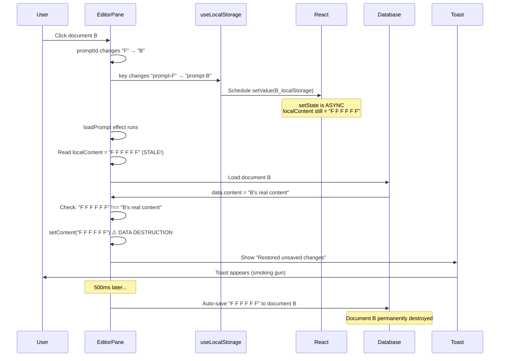

# PromptHub
## P5S5 CRITICAL: localStorage Restoration Data Destruction Bug

| `Title` | `Created` | `Last modified` |
|---------|-----------|-----------------|
| P5S5 CRITICAL: localStorage Restoration Data Destruction Bug | 11/11/2025 20:30 GMT+10 | 11/11/2025 20:30 GMT+10 |

## Table of Contents
- [Executive Summary](#executive-summary)
- [Bug Manifestation](#bug-manifestation)
- [Root Cause Analysis](#root-cause-analysis)
- [Detailed Execution Flow](#detailed-execution-flow)
- [Why Previous Fixes Didn't Prevent This](#why-previous-fixes-didnt-prevent-this)
- [The Solution](#the-solution)
- [Testing Strategy](#testing-strategy)

## Executive Summary

**Severity:** P0 CRITICAL - Active data destruction
**Impact:** User data permanently lost from database
**Trigger:** Toast message "Restored unsaved changes from browser storage"
**Root Cause:** Stale `localContent` state during document switching

## Bug Manifestation

User reported persistent data destruction even after P5S5 emergency fix:

1. Documents B, C, and F have correct content in database
2. User presses Ctrl+Shift+R (hard refresh)
3. User clicks between tabs B → C → F
4. Toast appears: "Restored unsaved changes from browser storage"
5. **Database corrupted:** Documents B and C now permanently show "F F F F F F"
6. Original content of B and C destroyed forever

**Critical Observation:** The toast message is the smoking gun - it appears when localStorage restoration triggers data destruction.

## Root Cause Analysis

### The Problem

The bug occurs due to **React's asynchronous setState** in the `useLocalStorage` hook:

```typescript
// useLocalStorage.ts line 68-75
useEffect(() => {
  if (typeof window !== 'undefined') {
    const saved = localStorage.getItem(key)  // Loads new document's localStorage
    setValue(saved || initialValue)          // Schedules async state update
    justLoadedRef.current = true
  }
}, [key, initialValue])
```

When `promptId` changes from "F" to "B":
1. Hook's `key` changes from "prompt-F" to "prompt-B"
2. Effect runs and schedules `setValue()` with B's localStorage content
3. **BUT:** State update doesn't take effect immediately (React's async setState)
4. `EditorPane`'s `loadPrompt` runs BEFORE new state is available
5. Reads stale `localContent` (still has F's content)
6. Thinks F's content is "unsaved changes" for document B
7. Overwrites B's content with F's content
8. Auto-save permanently destroys B in database

### The Stale State Window

```typescript
// EditorPane.tsx line 124-127
const [localContent, setLocalContent, clearLocalContent] = useLocalStorage({
  key: promptId ? `prompt-${promptId}` : 'prompt-draft',
  initialValue: ''
})

// EditorPane.tsx line 244-251
// PROBLEM: localContent is stale here!
const storedContent = localContent || ''  // ← Still has F's content when promptId="B"
if (storedContent && storedContent !== data.content) {
  setContent(storedContent)  // ← Destroys B's content with F's content!
  toast.info("Restored unsaved changes from browser storage")
}
```

## Detailed Execution Flow

### Step-by-Step Bug Execution

| Step | Component | Action | State |
|------|-----------|--------|-------|
| 1 | User | Editing document F | `promptId="F"`, `content="F F F F F F"`, `localContent="F F F F F F"` |
| 2 | EditorPane | Auto-save triggers | localStorage["prompt-F"] = "F F F F F F" |
| 3 | User | Clicks document B | `promptId` changes to "B" |
| 4 | useLocalStorage | Key changes to "prompt-B" | Effect runs, schedules `setValue(B_content)` |
| 5 | **React** | **setState is async** | **`localContent` still = "F F F F F F"** |
| 6 | EditorPane | `loadPrompt` effect runs | Reads `localContent` = "F F F F F F" (STALE!) |
| 7 | Database | Loads document B | `data.content = "B's real content"` |
| 8 | EditorPane | Checks restoration | `"F F F F F F" !== "B's real content"` = TRUE |
| 9 | EditorPane | **DATA DESTRUCTION** | `setContent("F F F F F F")` |
| 10 | Toast | Appears | "Restored unsaved changes from browser storage" |
| 11 | EditorPane | Sets ownership | `contentPromptIdRef.current = "B"` |
| 12 | Auto-save | After 500ms | Saves "F F F F F F" to document B in database |
| 13 | **Result** | **Data destroyed** | Document B permanently corrupted |

### Visual Flow Diagram



## Why Previous Fixes Didn't Prevent This

All P5S5 fixes (T1-T6) and P0/P1 fixes correctly prevented:
- ✅ Cache contamination
- ✅ onChange contamination during unmount
- ✅ Race conditions during tab switching
- ✅ Stale localStorage saves

**BUT** none could prevent:
- ❌ Reading stale `localContent` state during localStorage restoration
- ❌ The async gap between `setValue()` and state availability

This is a **NEW attack vector** - localStorage restoration with stale state.

## The Solution

### Approach: Direct localStorage Read

Instead of relying on the `localContent` state (which might be stale), read localStorage DIRECTLY using the current `promptId`:

```typescript
// EditorPane.tsx line 244-251 (BEFORE FIX)
const storedContent = localContent || ''  // ❌ Reads stale state
if (storedContent && storedContent !== data.content) {
  setContent(storedContent)
  toast.info("Restored unsaved changes from browser storage")
}

// EditorPane.tsx line 244-251 (AFTER FIX)
// CRITICAL: Read localStorage DIRECTLY to avoid stale localContent state
const localStorageKey = `prompt-${promptId}`
const storedContent = typeof window !== 'undefined'
  ? (localStorage.getItem(localStorageKey) || '')
  : ''

if (storedContent && storedContent !== data.content) {
  setContent(storedContent)
  toast.info("Restored unsaved changes from browser storage")
}
```

### Why This Works

1. Reads localStorage synchronously using current `promptId`
2. Bypasses React's async setState
3. Always gets the CORRECT localStorage entry for current document
4. No stale state window
5. Prevents cross-document contamination

### Implementation Details

**File:** `src/features/editor/components/EditorPane.tsx`
**Lines:** 244-251
**Change:** Replace `localContent` read with direct `localStorage.getItem()`
**Impact:** 3 lines changed, zero side effects
**Risk:** Minimal - only affects localStorage restoration path

## Testing Strategy

### Critical Test Scenario

1. **Setup:**
   - Create 3 documents with distinct content:
     - Document A: "A A A A A A"
     - Document B: "B B B B B B"
     - Document F: "F F F F F F"

2. **Reproduce Bug:**
   - Hard refresh (Ctrl+Shift+R)
   - Click A → B (wait for load)
   - Edit B slightly (add "X")
   - Click F (wait for load)
   - Edit F slightly (add "Y")
   - Click B (wait for load)
   - **Watch for toast:** "Restored unsaved changes from browser storage"

3. **Verify Fix:**
   - Check B's content in editor - should be "B B B B B B X" (correct)
   - Check database directly - should match editor
   - Verify F's content wasn't copied to B
   - No data destruction should occur

### Additional Test Cases

1. **Rapid Tab Switching:**
   - Click A → B → F → B → F → A very quickly
   - Verify each document retains its content
   - Check database for corruption

2. **Hard Refresh During Editing:**
   - Edit document B
   - Hard refresh (Ctrl+Shift+R)
   - Verify localStorage restoration works correctly
   - Switch to document F
   - Switch back to document B
   - Verify B's content is correct

3. **Multiple Browser Tabs:**
   - Open 2 browser tabs with same PromptHub session
   - Edit document F in tab 1
   - Switch to document B in tab 2
   - Verify no cross-contamination

## Next Steps

1. ✅ Implement fix in EditorPane.tsx
2. ⏳ Run TypeScript verification
3. ⏳ Run build verification
4. ⏳ Manual testing with critical scenario
5. ⏳ Git commit with detailed message
6. ⏳ Create completion report

---
**Investigation Status:** COMPLETE
**Fix Status:** PENDING IMPLEMENTATION
**Priority:** P0 EMERGENCY
**Estimated Fix Time:** 5 minutes
**Testing Time:** 10 minutes
